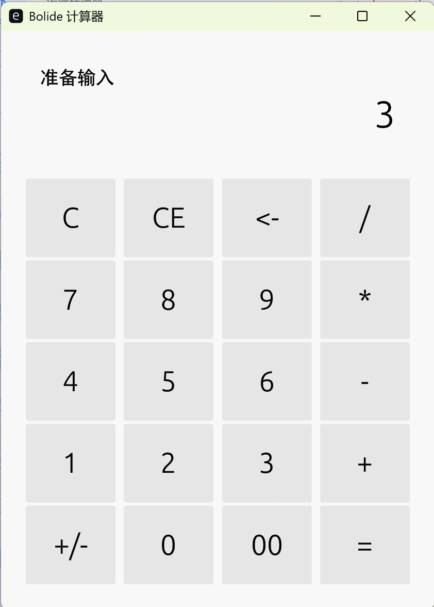

<p align="center">
  
  <br>
  <b style="font-size: 32px;">Bolide</b>
  <br>
  <i>现代化 JIT/AOT 编译型编程语言</i>
  <br>
</p>

<p align="center">
  <a href="https://opensource.org/licenses/MIT">
    
  </a>
  <a href="#">
    
  </a>
  <a href="#">
    
  </a>
</p>

<p align="center">
  
</p>

---

**Bolide** 是一门现代化编程语言，基于 **Cranelift** 实现 JIT/AOT 编译，兼具简洁语法与原生性能。

## 特性

- **JIT 编译** - 基于 Cranelift 的即时编译，快速启动
- **AOT 编译** - 提前编译为原生可执行文件，无需运行时
- **异步协程** - 一等公民的 async/await 支持
- **FFI** - 无缝调用 C 库，支持回调函数
- **模块系统** - 命名空间隔离的模块导入
- **丰富类型** - BigInt、Decimal、Dynamic 等
- **并发支持** - 线程、通道、线程池
- **内存管理** - ARC 引用计数 + 生命周期注解 + weak/unowned 引用

## 快速开始

### 从源码构建

```bash
# 克隆仓库
git clone https://github.com/your-repo/bolide.git
cd bolide

# 构建
cargo build --release

# 运行程序
cargo run --release -- run examples/hello.bl
```

### 使用 Release 版本

下载对应平台的 Release 包后：

```bash
# Windows
bolide.exe run your_program.bl

# Linux / macOS
./bolide run your_program.bl
```

### AOT 编译

将 Bolide 程序编译为独立的原生可执行文件：

```bash
# 编译为可执行文件
bolide compile your_program.bl -o your_program

# Windows 会生成 your_program.exe
# Linux/macOS 会生成 your_program

# 直接运行编译后的程序
./your_program
```

AOT 编译的优势：
- **无需运行时** - 生成的可执行文件可独立运行
- **更快启动** - 跳过 JIT 编译阶段
- **便于分发** - 单文件部署，无依赖

> **注意**: AOT 模式目前功能支持不如 JIT 完整（JIT 是参考实现）。已知差距包括：
> 列表/字典/元组的打印与部分方法、线程 `join`、`async select`、类继承方法调用、
> 函数作为值传递、部分 bigint/decimal 转换等（完整清单见 todo.md 的 AOT 对齐一节）。
> 建议开发阶段使用 JIT 模式（`bolide run`），发布前用 AOT 编译结果完整测试。

## 语法示例

### 变量与类型

```bolide
let x: int = 42;
let pi: float = 3.14159;
let name: str = "Bolide";
let flag: bool = true;
let big: bigint = 123456789012345678901234567890b;
let precise: decimal = 3.14159265358979d;

// 数字字面量支持下划线分隔
let million: int = 1_000_000;

// 字符串支持转义序列: \" \\ \n \t \r \0
let quoted: str = "he said \"hi\"\nsecond line";
```

### 用户输入

使用 `input()` 函数从标准输入读取用户输入（类似 Python）：

```bolide
// 带提示的输入
let name: str = input("请输入你的名字: ");
print(name);

// 无提示的输入
let content: str = input();
```

### 类型转换

Bolide 提供了完整的类型转换函数：

```bolide
// int() - 转整数
let a: int = int(3.7);       // float -> int (截断) = 3
let b: int = int("123");     // str -> int = 123
let c: int = int(999B);      // bigint -> int = 999
let d: int = int(45.6D);     // decimal -> int = 45

// float() - 转浮点数
let e: float = float(100);       // int -> float = 100.0
let f: float = float("2.718");   // str -> float = 2.718
let g: float = float(1.5D);      // decimal -> float = 1.5

// str() - 转字符串
let h: str = str(12345);         // int -> str = "12345"
let i: str = str(3.14159);       // float -> str = "3.14159"
let j: str = str(true);          // bool -> str = "true"
let k: str = str(123456789B);    // bigint -> str = "123456789"
let l: str = str(99.99D);        // decimal -> str = "99.99"

// bigint() 和 decimal()
let m: bigint = bigint(100);     // int -> bigint
let n: decimal = decimal(3.14);  // float -> decimal
```

### 函数

```bolide
fn add(a: int, b: int) -> int {
    return a + b;
}

fn greet(name: str) {
    print(name);
}
```

### 控制流

```bolide
// if-elif-else
if x > 0 {
    print("positive");
} elif x < 0 {
    print("negative");
} else {
    print("zero");
}

// for 循环 - Python 风格 range
for i in range(5) { print(i); }           // 0, 1, 2, 3, 4
for i in range(3, 7) { print(i); }        // 3, 4, 5, 6
for i in range(0, 10, 2) { print(i); }    // 0, 2, 4, 6, 8
for i in range(10, 0, -2) { print(i); }   // 10, 8, 6, 4, 2 (负步长)

// for 循环 - 列表遍历
let nums: list<int> = [10, 20, 30];
for n in nums {
    print(n);
}

// while 循环
while x > 0 {
    x = x - 1;
}

// 复合赋值
let n: int = 10;
n += 5;   // 15
n -= 3;   // 12
n *= 2;   // 24
n /= 4;   // 6
n %= 4;   // 2

// break / continue
let total: int = 0;
for i in range(10) {
    if i == 3 {
        continue;  // 跳过本次迭代
    }
    if i == 6 {
        break;     // 跳出循环
    }
    total += i;
}

// for 循环 - 字典遍历 (Python 风格)
let scores = {"Alice": 100, "Bob": 85};
for k, v in scores {
    print(k);  // 键
    print(v);  // 值
}
```

### 列表操作

Bolide 提供了丰富的 Python 风格列表操作：

```bolide
let nums: list<int> = [3, 1, 4, 1, 5, 9];

// 基本操作
nums.push(10);           // 追加元素
let x: int = nums.pop(); // 弹出最后一个元素
print(nums.len());       // 获取长度

// 索引访问
print(nums[0]);          // 获取元素
nums[0] = 100;           // 设置元素

// 插入和删除
nums.insert(1, 42);      // 在索引 1 处插入
let removed: int = nums.remove(2);  // 移除索引 2 的元素

// 搜索
print(nums.contains(4)); // 是否包含值 (返回 0 或 1)
print(nums.index_of(4)); // 查找索引 (找不到返回 -1)
print(nums.count(1));    // 统计出现次数

// 工具方法
print(nums.first());     // 第一个元素
print(nums.last());      // 最后一个元素
print(nums.is_empty());  // 是否为空

// 修改操作
nums.reverse();          // 原地反转
nums.sort();             // 原地排序

// 切片和扩展
let sliced: list<int> = nums.slice(1, 4);  // 切片 [1:4)
let more: list<int> = [100, 200];
nums.extend(more);       // 扩展列表

// 复制和清空
let copy: list<int> = nums.copy();  // 复制列表
nums.clear();            // 清空列表

// 直接打印列表
print(nums);             // 输出: [1, 2, 3, ...]
```

### 字典 (Dictionaries)

Bolide 支持强类型和混合类型的动态字典，语法类似于 Python：

```bolide
// 强类型字典
let scores: dict<str, int> = {"Alice": 100, "Bob": 90};
print(scores["Alice"]);  // 100

// 混合类型字典 (自动推导为 dict<dynamic, dynamic>)
// 支持异构键和值，自动进行装箱处理
let profile = {"name": "Bolide", 1: "Version", "active": true};
print(profile["name"]);  // "Bolide"
print(profile[1]);       // "Version"

// 常用操作
scores["Charlie"] = 95;     // 插入/更新
scores.remove("Bob");       // 删除
print(scores.len());        // 获取长度
print(scores.contains("Alice")); // 检查键是否存在
print(scores.keys());       // 获取所有键
print(scores.values());     // 获取所有值
```

### Async/Await


```bolide
async fn fetch_data(id: int) -> int {
    return id * 10;
}

// 启动协程
let f1: future = fetch_data(1);
let f2: future = fetch_data(2);

// 等待结果
let r1: int = await f1;
let r2: int = await f2;
```

### 高级并发特性

#### Await All (并发等待)

```bolide
async fn fetch_a() -> int { return 100; }
async fn fetch_b() -> int { return 200; }

// 并发执行所有任务并等待结果（返回元组）
let results: (int, int) = await all {
    fetch_a(),
    fetch_b()
};
print(results[0]);  // 100
print(results[1]);  // 200

// 类型标注可以省略，编译器会根据各协程的返回类型自动推断为元组
let inferred = await all {
    fetch_a(),
    fetch_b()
};
print(inferred[0]);  // 100
```

#### Async Select (竞态等待)

```bolide
// 等待第一个完成的任务
async select {
    res1 = task_fast() => {
        print("fast finished");
    }
    res2 = task_slow() => {
        print("slow finished");
    }
}
```

### 多线程与并行

#### Spawn & Join

使用 `spawn`关键字在新的系统线程中启动任务：

```bolide
fn heavy_work(id: int) -> int {
    // 耗时计算...
    return id * id;
}

// 启动新线程
let t: future = spawn heavy_work(10);

// 等待线程结束并获取结果
let result: int = join(t);
```

#### 线程池 (Thread Pool)

使用 `pool` 块将任务分发到指定大小的线程池中执行：

```bolide
pool(4) {
    // 这些任务将在4个工作线程中并发执行
    spawn task(1);
    spawn task(2);
    spawn task(3);
}
// pool 块结束时会自动等待所有任务完成
```

#### 通道 (Channels)

线程间安全的通信机制：

```bolide
// 创建通道
let ch: channel<int> = channel();

// 定义发送函数
fn sender(c: channel<int>) {
    c <- 42;
}

// 启动发送线程
spawn sender(ch);

let val: int = <- ch;  // 接收数据
```

#### Channel Select (多路复用)

使用 `select` 语句处理多个通道操作，支持超时和默认分支：

```bolide
select {
    val1 <- ch1 => {
        print("Received from ch1");
    }
    timeout(100) => {
        print("Timed out");
    }
    default => {
        print("No data available");
    }
}
```

### 模块系统

模块按文件导入，所有符号位于以文件名命名的命名空间内（不污染全局命名空间）：

```bolide
// math_utils.bl
fn add(a: int, b: int) -> int {
    return a + b;
}

// main.bl
import "math_utils.bl";

let result: int = math_utils.add(10, 20);
print(result);  // 30

// 使用 as 指定别名
import "math_utils.bl" as mu;
print(mu.add(1, 2));  // 3
```

**导入路径解析规则**（确定性顺序，不依赖进程工作目录）：

1. 绝对路径按原样使用；
2. 相对路径基于**导入方源文件所在目录**解析；
3. `BOLIDE_HOME` 环境变量指向的目录（开发期可指向仓库根，以便 `import "std/..."`）；
4. `bolide` 可执行文件所在目录（发行版布局：`std/` 与可执行文件同级）。

### 标识符与内置函数隔离

运行时内置函数位于编译器内部的 `@_` 命名空间（`@` 不是合法标识符字符），
与用户代码完全隔离：

- 用户函数可以使用任何合法标识符，包括 `print_bigint`、`list_push` 这类与
  运行时内部函数同名的名字，不会冲突或递归；
- 运行时内部 ABI（如 `list_push`、`object_alloc`）**不暴露**给用户代码，
  列表/字典操作请使用方法语法（`xs.push(3)`）；
- 用户可直接调用的内置函数（`print`、`input`、`range`、`str`/`int`/`float`
  等类型转换、`join`、`channel`）是显式白名单，不受隔离影响。

### 变量与作用域

- 顶层 `let` 声明**全局变量**，函数内可读取、赋值（GUI 回调依赖这一点）；
- 函数内的 `let` 声明**局部变量**，同名时遮蔽全局变量；
- 全局变量与局部变量能力一致：可作 `ref` 实参、可作通道用于
  `<-` 收发与 `select`、支持 `float` 等全部类型。

### 类与面向对象

```bolide
class Point {
    x: int;
    y: int;

    fn distance() -> int {
        return self.x * self.x + self.y * self.y;
    }

    fn move_by(dx: int, dy: int) {
        self.x = self.x + dx;
        self.y = self.y + dy;
    }
}

// 使用构造函数直接初始化字段
let p: Point = Point(3, 4);
print(p.distance());  // 25

p.move_by(1, 1);
print(p.x);  // 4
print(p.y);  // 5

// 继承
class Animal {
    age: int;
    fn get_age() -> int { return self.age; }
}

class Dog: Animal {
    name: int;
    fn bark() -> int { return 100; }
}

let dog: Dog = Dog(3, 42);  // age=3, name=42
print(dog.get_age());  // 3 (继承的方法)
print(dog.bark());     // 100
```

### FFI (C 语言互操作)

```bolide
// 声明 C 函数
extern "msvcrt.dll" {
    fn abs(x: c_int) -> c_int;
    fn sqrt(x: c_double) -> c_double;
}

let a: int = abs(-42);      // 42
let b: float = sqrt(16.0);  // 4.0

// 支持回调函数
fn my_callback(a: int, b: int) -> int {
    return a + b;
}
let r: int = test_callback(my_callback, 10, 20);
```

### 错误处理 (try/catch/throw)

Bolide 提供了轻量级的异常处理机制：`throw` 抛出异常，`try/catch` 捕获异常，支持可选的 `finally` 清理块。

#### 基本用法

```bolide
try {
    print("in try body");
    throw 42;
    print("after throw (will not print)");
} catch (e: int) {
    print("caught: ");
    print(e);  // 42
}
print("after try/catch");
```

#### 语法

```
throw_stmt = { "throw" ~ expr ~ ";" }
try_stmt  = { "try" ~ block ~ catch_clause+ ~ finally? }
catch_clause = { "catch" ~ "(" ~ ident ~ ":" ~ type_expr ~ ")" ~ block }
```

- **`throw`** 可以抛出任意类型的值（`int`、`str`、对象等）
- **`catch (e: T)`** 通过类型标签匹配异常，支持子类匹配（编译器自动展开）
- **`finally`** 块无论是否抛出异常都会执行，适合资源清理

#### 嵌套 try/catch

```bolide
try {
    try {
        throw 42;
    } catch (e: int) {
        print("inner catch: " + str(e));
    }
    print("after inner try");
} catch (e: int) {
    print("outer catch (should not reach)");
}
```

#### 重新抛出 (Rethrow)

```bolide
try {
    try {
        throw 77;
    } catch (e: int) {
        print("rethrowing: " + str(e));
        throw e;  // 重新抛出
    }
} catch (e: int) {
    print("outer catch: " + str(e));  // 77
}
```

#### finally 清理

```bolide
fn open_file(path: str) -> int {
    // ... open file, return handle
    return 1;
}

fn close_file(handle: int) {
    // ... close file
}

let handle: int = open_file("data.txt");
try {
    // ... 可能抛出异常的代码
    throw "something went wrong";
} catch (e: str) {
    print("error: " + e);
} finally {
    close_file(handle);  // 一定会执行
    print("cleanup done");
}
```

#### 实现原理

不使用 `setjmp/longjmp`（与 Cranelift SSA 寄存器分配不兼容）。编译器维护一个 **catch 落点栈**：`throw` 将异常值和类型标签存入 thread-local，然后直接跳转到最近的 catch 块。异常值通过内存（thread-local）传递，不经过寄存器，因此 SSA 安全。

类型标签机制：
- 基本类型（`int`、`float`、`str` 等）有固定标签
- 自定义类按声明顺序分配 ID（≥100）
- `catch (e: T)` 的类型过滤在编译器展开为标签比较的 OR 链（含 T 的所有已知子类）

> **当前限制**: 仅支持同函数内的 try/catch（catch 与 throw 必须在同一编译函数内）。跨函数异常的栈展开计划在后续版本实现。

## 类型系统

| 类型 | 说明 | 示例 |
|------|------|------|
| `int` | 64位整数 | `let x: int = 42;` |
| `float` | 64位浮点数 | `let pi: float = 3.14;` |
| `bool` | 布尔值 | `let flag: bool = true;` |
| `str` | 字符串 | `let s: str = "hello";` |
| `bigint` | 任意精度整数 | `let b: bigint = 999b;` |
| `decimal` | 高精度小数 | `let d: decimal = 3.14d;` |
| `list<T>` | 泛型列表 | `let l: list<int> = [1, 2, 3];` |
| `tuple` | 元组 | `let t: tuple = (1, 2, 3);` |
| `channel<T>` | 通道 | `let ch: channel<int> = channel();` |
| `dict<K, V>` | 字典 | `let d: dict<str, int> = {"a": 1};` |
| `dynamic` | 动态类型 | (运行时自动推导) |
| `future` | 协程 Future | `let f: future = async_fn();` |


## 内存管理

Bolide 使用 **ARC (自动引用计数)** 作为默认内存管理方式。引用计数是**原子操作**（与 Swift/Rust Arc 相同的内存序），跨线程传递对象不会产生计数竞争。同时提供生命周期注解和弱引用来处理特殊场景。

### 生命周期注解 (from)

使用 `from` 关键字指定返回值的生命周期依赖，跳过 ARC 开销：

```bolide
// 返回值的生命周期依赖于参数 x
fn get_value(ref x: bigint) -> bigint from x {
    return x;
}

let a: bigint = 100B;
let b: bigint = get_value(a);  // b 借用 a，不增加引用计数
```

编译器会对借用施加以下检查，违反时**编译报错**：

- `from` 函数的返回值必须来源于声明的参数；
- 借用变量在来源离开作用域后不可继续存活（悬空检测）；
- 借用存活期间，**禁止对来源变量重新赋值**（旧对象会被释放）；
- 借用值**不允许逃逸**：不能存入列表/字典/元组/对象字段、不能通过
  `push`/`insert` 等存储型方法进入容器、不能通过通道发送或作为 `spawn`
  参数跨线程传递、不能从未声明 `from` 的函数返回。

需要让借用值逃逸时，请显式拷贝（如 `bigint(b)`）后再存储。

### weak 引用

`weak` 引用不增加强引用计数，用于打破循环引用：

```bolide
class Node {
    value: int;
}

let obj: Node = Node(42);

let w: weak Node = obj;  // weak 引用，不增加强引用计数
print(w.value);          // 访问前自动检查对象是否存活
```

weak 引用会持有对象头（弱引用计数），对象被释放后访问 weak 引用会触发
**确定性的运行时错误并中止程序**（带诊断信息），而不是未定义行为：

```text
runtime error: weak/unowned reference accessed after object was deallocated
```

### unowned 引用

`unowned` 引用同样不增加强引用计数，语义上假设对象始终存在。与 weak 相同，
访问时会进行存活检查——对象已释放时**立刻报错中止**，绝不会读到悬空内存：

```bolide
let obj: Node = Node(42);
let u: unowned Node = obj;  // unowned 引用
print(u.value);             // 对象存活时直接访问
```

> weak 与 unowned 的区别是语义意图：weak 表示"对象可能先于引用消亡"（典型如
> 子节点回指父节点），unowned 表示"对象保证活得比引用久"。两者目前都采用
> trap 式检查保证内存安全；未来引入可选类型后，weak 将支持 nil 分支处理。

### 并发安全

- 所有引用计数（强/弱）均为原子操作，跨线程 retain/release 无数据竞争；
- `spawn` 对传入对象采用 move 语义，原变量失效（运行时 MOVED 标记）；
- channel 当前只支持值类型传递，对象传递的 Arc 方案见 todo.md。


## 项目结构

```
bolide/
├── crates/
│   ├── bolide-cli/       # 命令行入口
│   ├── bolide-compiler/  # JIT 编译器 (Cranelift)
│   ├── bolide-parser/    # 词法/语法分析器 (PEG)
│   └── bolide-runtime/   # 运行时库
├── vscode-bolide/        # VS Code 插件
├── examples/             # 示例程序
└── README.md
```

## VS Code 插件

Bolide 提供了 VS Code 插件，支持语法高亮和一键运行。

### 安装方法

#### 方法 1: 复制到扩展目录（推荐）

将 `vscode-bolide` 文件夹复制到 VS Code 扩展目录：

- **Windows**: `%USERPROFILE%\.vscode\extensions\`
- **macOS**: `~/.vscode/extensions/`
- **Linux**: `~/.vscode/extensions/`

然后重启 VS Code。

#### 方法 2: 打包为 VSIX 安装

```bash
cd vscode-bolide
npm install
npm install -g @vscode/vsce
vsce package
```

然后在 VS Code 中按 `Ctrl+Shift+P`，输入 "Install from VSIX"，选择生成的 `.vsix` 文件。

### 配置

在 VS Code 设置中配置 Bolide 可执行文件路径：

```json
{
  "bolide.executablePath": "D:\\Project\\bolide_new\\target\\release\\bolide.exe"
}
```

### 使用

1. 打开 `.bl` 文件
2. 按 `Ctrl+Shift+R` 运行当前文件

## GUI 开发

Bolide 提供了原生 GUI 库 `std/gui`，支持窗口创建、控件管理及事件驱动编程。目前主要通过绝对定位进行布局。

### GUI 计算器示例

以下是一个完整的 GUI 计算器实现 (`examples/calculator.bl`)，展示了窗口、按钮、标签以及事件回调的用法：

```bolide
import "std/gui/gui.bl";

// ============================================================
// Bolide 简易计算器
// ============================================================

// 全局状态
let result: int = 0;
let current: int = 0;
let op: str = "";
let new_input: bool = true;
let expr_str: str = "0"; // 全局算式字符串

// GUI 控件
let win: gui.Window = gui.Window(0);
let display: gui.Label = gui.Label(0);

// 更新显示
fn update_display() {
    display.set_text(expr_str);
}

// 执行计算
fn do_calc() {
    if op == "+" {
        result = result + current;
    } elif op == "-" {
        result = result - current;
    } elif op == "*" {
        result = result * current;
    } elif op == "/" {
        if current != 0 {
            result = result / current;
        }
    } else {
        result = current;
    }
    current = result;
}

// 数字按钮回调
fn on_0() {
    if new_input {
        current = 0;
        if op == "" { expr_str = "0"; } else { expr_str = expr_str + "0"; }
        new_input = false;
    } else {
        current = current * 10 + 0;
        expr_str = expr_str + "0";
    }
    update_display();
}

fn on_1() {
    if new_input {
        current = 1;
        if op == "" { expr_str = "1"; } else { expr_str = expr_str + "1"; }
        new_input = false;
    } else {
        current = current * 10 + 1;
        expr_str = expr_str + "1";
    }
    update_display();
}

fn on_2() {
    if new_input {
        current = 2;
        if op == "" { expr_str = "2"; } else { expr_str = expr_str + "2"; }
        new_input = false;
    } else {
        current = current * 10 + 2;
        expr_str = expr_str + "2";
    }
    update_display();
}

fn on_3() {
    if new_input {
        current = 3;
        if op == "" { expr_str = "3"; } else { expr_str = expr_str + "3"; }
        new_input = false;
    } else {
        current = current * 10 + 3;
        expr_str = expr_str + "3";
    }
    update_display();
}

fn on_4() {
    if new_input {
        current = 4;
        if op == "" { expr_str = "4"; } else { expr_str = expr_str + "4"; }
        new_input = false;
    } else {
        current = current * 10 + 4;
        expr_str = expr_str + "4";
    }
    update_display();
}

fn on_5() {
    if new_input {
        current = 5;
        if op == "" { expr_str = "5"; } else { expr_str = expr_str + "5"; }
        new_input = false;
    } else {
        current = current * 10 + 5;
        expr_str = expr_str + "5";
    }
    update_display();
}

fn on_6() {
    if new_input {
        current = 6;
        if op == "" { expr_str = "6"; } else { expr_str = expr_str + "6"; }
        new_input = false;
    } else {
        current = current * 10 + 6;
        expr_str = expr_str + "6";
    }
    update_display();
}

fn on_7() {
    if new_input {
        current = 7;
        if op == "" { expr_str = "7"; } else { expr_str = expr_str + "7"; }
        new_input = false;
    } else {
        current = current * 10 + 7;
        expr_str = expr_str + "7";
    }
    update_display();
}

fn on_8() {
    if new_input {
        current = 8;
        if op == "" { expr_str = "8"; } else { expr_str = expr_str + "8"; }
        new_input = false;
    } else {
        current = current * 10 + 8;
        expr_str = expr_str + "8";
    }
    update_display();
}

fn on_9() {
    if new_input {
        current = 9;
        if op == "" { expr_str = "9"; } else { expr_str = expr_str + "9"; }
        new_input = false;
    } else {
        current = current * 10 + 9;
        expr_str = expr_str + "9";
    }
    update_display();
}

// 运算符回调
fn on_add() {
    if op != "" { do_calc(); } else { result = current; }
    op = "+";
    new_input = true;
    expr_str = expr_str + " + ";
    update_display();
}

fn on_sub() {
    if op != "" { do_calc(); } else { result = current; }
    op = "-";
    new_input = true;
    expr_str = expr_str + " - ";
    update_display();
}

fn on_mul() {
    if op != "" { do_calc(); } else { result = current; }
    op = "*";
    new_input = true;
    expr_str = expr_str + " * ";
    update_display();
}

fn on_div() {
    if op != "" { do_calc(); } else { result = current; }
    op = "/";
    new_input = true;
    expr_str = expr_str + " / ";
    update_display();
}

fn on_eq() {
    if op != "" {
        do_calc();
        op = "";
        expr_str = expr_str + " = " + str(current);
    }
    new_input = true;
    update_display();
}

fn on_clear() {
    result = 0;
    current = 0;
    op = "";
    new_input = true;
    expr_str = "0";
    update_display();
}

fn on_neg() {
    current = 0 - current;
    // 显示当前值
    expr_str = str(current); 
    update_display();
}

// ============================================================
// 主程序
// ============================================================

gui.init();
win = gui.window("Bolide 计算器", 300, 400);
win.center();

// 显示区域
display = gui.label(win, "0", 15, 15, 270, 60);

// 按钮布局
let bw: int = 65;
let bh: int = 50;
let margin: int = 15;
let spacing: int = 5;
let start_y: int = 85;

// 第一行: C, +/-, /, *
let bc: gui.Button = gui.button(win, "C", margin, start_y, bw, bh); bc.on_click(on_clear);
let bn: gui.Button = gui.button(win, "+/-", margin + bw + spacing, start_y, bw, bh); bn.on_click(on_neg);
let bd: gui.Button = gui.button(win, "/", margin + 2 * (bw + spacing), start_y, bw, bh); bd.on_click(on_div);
let bm: gui.Button = gui.button(win, "*", margin + 3 * (bw + spacing), start_y, bw, bh); bm.on_click(on_mul);

// 第二行: 7, 8, 9, -
let y2: int = start_y + bh + spacing;
let b7: gui.Button = gui.button(win, "7", margin, y2, bw, bh); b7.on_click(on_7);
let b8: gui.Button = gui.button(win, "8", margin + bw + spacing, y2, bw, bh); b8.on_click(on_8);
let b9: gui.Button = gui.button(win, "9", margin + 2 * (bw + spacing), y2, bw, bh); b9.on_click(on_9);
let bs: gui.Button = gui.button(win, "-", margin + 3 * (bw + spacing), y2, bw, bh); bs.on_click(on_sub);

// 第三行: 4, 5, 6, +
let y3: int = start_y + 2 * (bh + spacing);
let b4: gui.Button = gui.button(win, "4", margin, y3, bw, bh); b4.on_click(on_4);
let b5: gui.Button = gui.button(win, "5", margin + bw + spacing, y3, bw, bh); b5.on_click(on_5);
let b6: gui.Button = gui.button(win, "6", margin + 2 * (bw + spacing), y3, bw, bh); b6.on_click(on_6);
let ba: gui.Button = gui.button(win, "+", margin + 3 * (bw + spacing), y3, bw, bh); ba.on_click(on_add);

// 第四行: 1, 2, 3, =
let y4: int = start_y + 3 * (bh + spacing);
let b1: gui.Button = gui.button(win, "1", margin, y4, bw, bh); b1.on_click(on_1);
let b2: gui.Button = gui.button(win, "2", margin + bw + spacing, y4, bw, bh); b2.on_click(on_2);
let b3: gui.Button = gui.button(win, "3", margin + 2 * (bw + spacing), y4, bw, bh); b3.on_click(on_3);
let be: gui.Button = gui.button(win, "=", margin + 3 * (bw + spacing), y4, bw, bh); be.on_click(on_eq);

// 第五行: 0
let y5: int = start_y + 4 * (bh + spacing);
let b0: gui.Button = gui.button(win, "0", margin, y5, bw * 2 + spacing, bh); b0.on_click(on_0);
let b00: gui.Button = gui.button(win, "00", margin + 2 * (bw + spacing), y5, bw * 2 + spacing, bh); b00.on_click(on_0);

print("Bolide 计算器已启动！");
gui.run();
```

### 关键概念

- **初始化与运行**: 必须调用 `gui.init()` 初始化环境，最后调用 `gui.run()` 进入事件循环。
- **窗口**: 使用 `gui.window(title, width, height)` 创建窗口。
- **控件**:
    - `gui.label(parent, text, x, y, w, h)`: 静态文本
    - `gui.button(parent, text, x, y, w, h)`: 按钮
- **事件**: 使用 `button.on_click(callback)` 绑定点击事件，回调函数必须是无参函数。
- **布局**: 计算器示例使用了绝对坐标计算 (`x, y, w, h`) 来排布按钮。

## 许可证

MIT License
